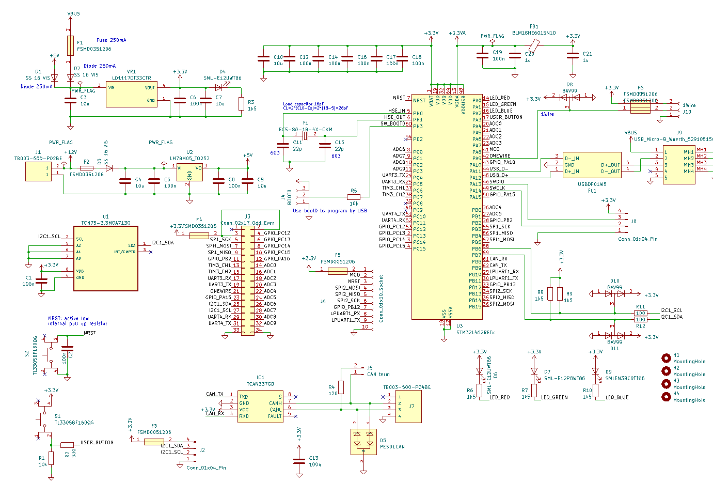
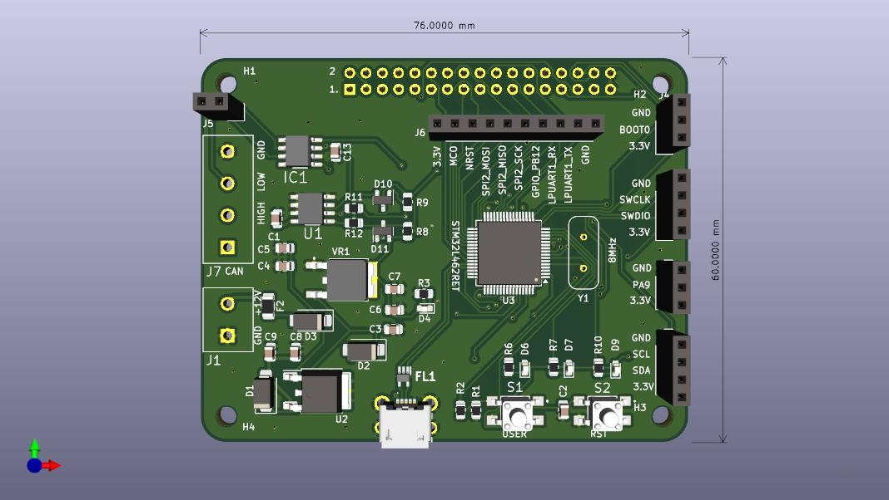
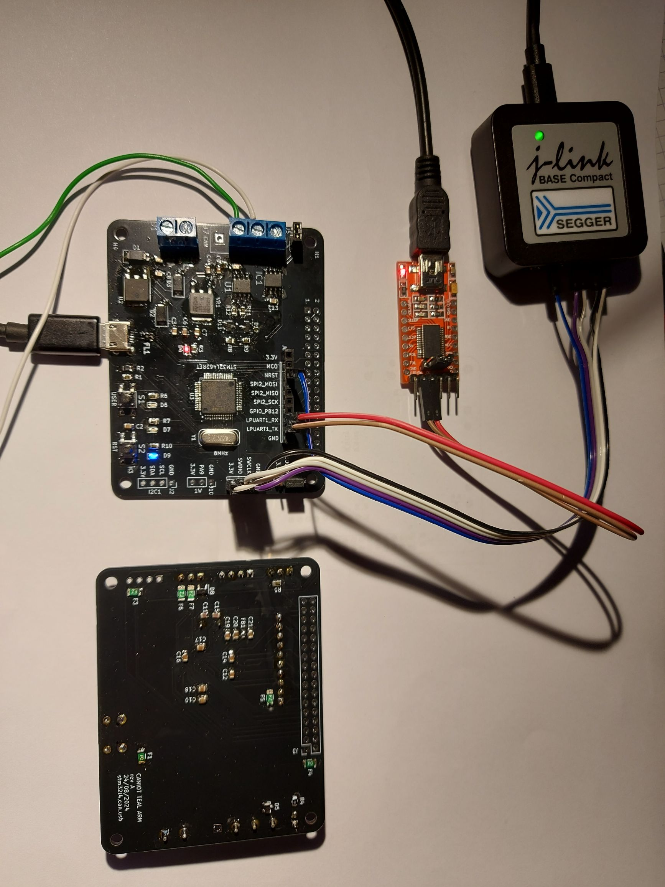

# Teal caniot device

`teal` is a custom board for an home automation system.
It is based on the `stm32l462re` microcontroller.
The current design replaces [caniot-device](https://github.com/lucasdietrich/caniot-device?tab=readme-ov-file#boards) 
boards (i.e. V1 and Tiny boards) based on an 8-bit AVR microcontroller.

Features:
- CAN
- USB
- TCN75A temperature sensor
- UART/SPI/I2C/1-Wire/ADC
- USB or 12V power supply

## Specs

- Zephyr board definition: [teal](./boards/arm/teal_caniot)
    - Devicetree: [teal_caniot.dts](./boards/arm/teal_caniot/teal_caniot.dts)
    - Board configuration: [teal_caniot_defconfig](./boards/arm/teal_caniot/teal_caniot_defconfig)

<table>
  <tr>
    <td></td>
    <td></td>
  </tr>
  <tr>
    <td></td>
  </tr>
</table>

## Demo firmware

Build zephyr project with `CONFIG_TEST=y` to enable the demo firmware.

Expected output:

```
*** Booting Zephyr OS build v3.7.0-1-g814766ed8dcb ***
USB status: 1
Set up button at gpioUSB status: 5
@48000000 pin 3
Set up LED at gpio@48000000 pin 0
Set up LED at gpio@48000000 pin 1
Set up LED at gpio@48000000 pin 2
Press the button
D: Waiting for DTR
device is 0x800fd2c, name is tcn75a@48
temperature 0.000000
USB status: 6
USB status: 1
USB status: 1
USB status: 1
USB status: 1
USB status: 3
D: Waiting for DTR
D: Waiting for DTR
temperature 25.000000
E: Msgq 0x200002a8 overflowed. Frame ID: 0x68d
E: Msgq 0x200002a8 overflowed. Frame ID: 0x6cd
E: Msgq 0x200002a8 overflowed. Frame ID: 0x70d
E: Msgq 0x200002a8 overflowed. Frame ID: 0x74d
D: Baudrate detected: 115200
CAN frame received
ID: 1549
DLC: 8
Data: 255 255 7 254 253 255 255 255
CAN frame received
ID: 1613
DLC: 8
Data: 255 255 7 254 253 255 255 255
temperature 25.000000
D: dev 0x800fcc8
D: dev 0x800fcc8 send 2 bytes
D: dev 0x800fcc8 wrote len 2
D: dev 0x800fcc8
D: dev 0x800fcc8 TX buffer empty
D: dev 0x800fcc8
D: dev 0x800fcc8 send 1 bytes
D: dev 0x800fcc8 wrote len 1
D: dev 0x800fcc8
D: dev 0x800fcc8 TX buffer empty
```